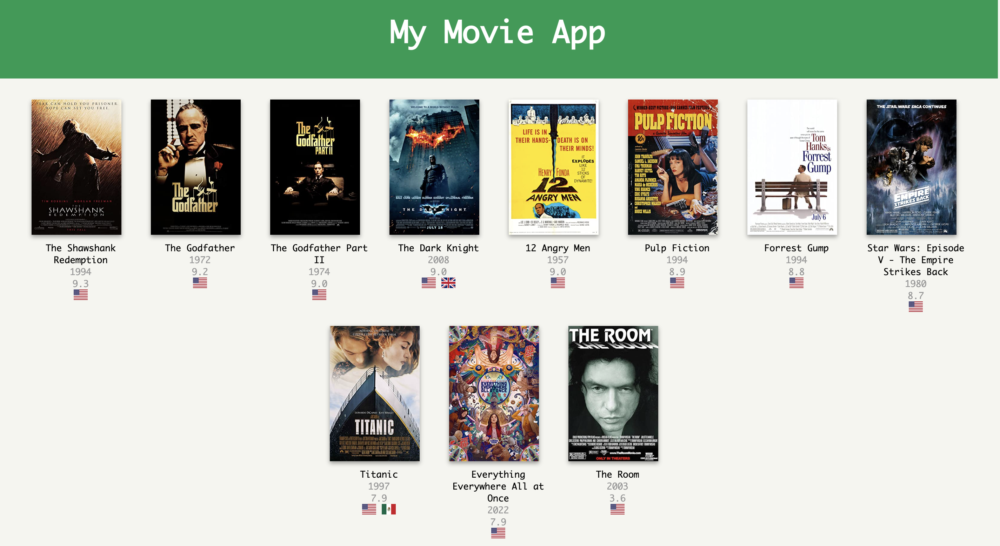

# Movies
A python mini project reading and writing JSON data to HTML using API requests. 
Getting movie name, year, rating, imdb website, and flags information from API upon user input movie name.

